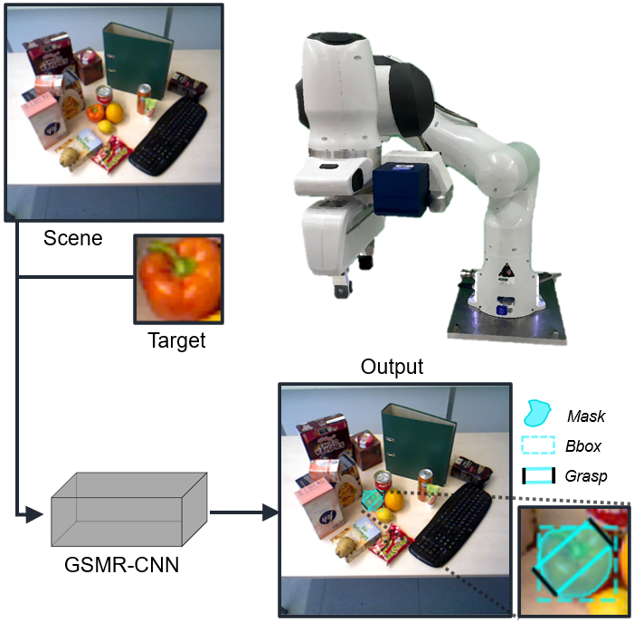
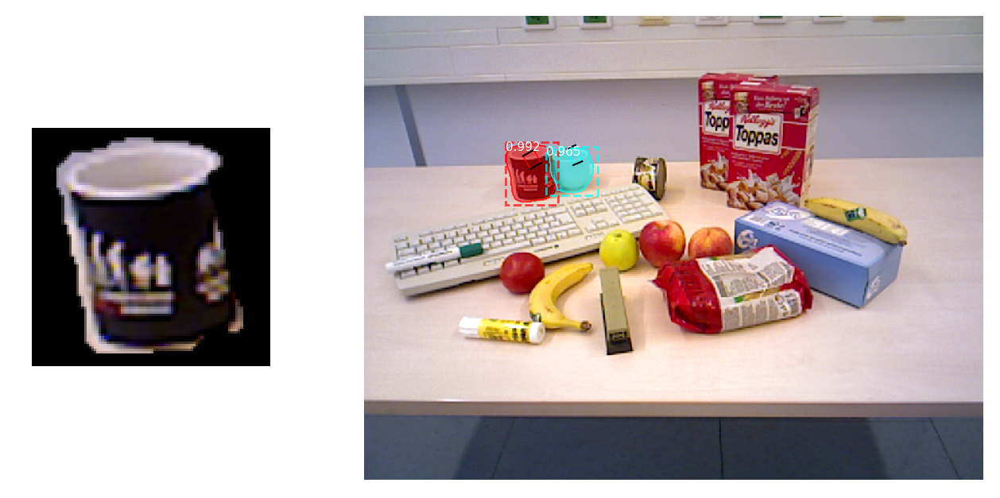

# Grasping Siamese Mask R-CNN (GSMR-CNN)



This repository contains the code implementation for the GSMR-CNN model from the ICRA23 paper "GSMR-CNN: An End-to-End Trainable Architecture for Grasping Target Objects from Multi-Object Scenes". The Grasping Siamese Mask R-CNN (GSMR-CNN) is an extension of the __[Siamese Mask R-CNN](https://github.com/bethgelab/siamese-mask-rcnn)__ that adds an additional branch for grasp detection. 

GSMR-CNN takes as input both an RGB image of a multi-object scene and an RGB image of the target object (e.g. pepper) to be located and grasped. The model then finds and outputs all instances of the target object in the scene with a corresponding bounding box, segmentation mask and a 2D antipodal grasp for each instance. The inherent SNN properties enable the proposed model to generalize and recognize new object categories that were not present during training, whilst the end-to-end architecture allows the model to identify target objects with a suitable grasp simultaneously.

Below is an example prediction from GSMR-CNN trying to locate and predicts grasps on mugs within a multi-object scene.
<p align="center">
  
 </p>

## Getting Started
To train and evaluate a GSMR-CNN model, you can follow the notebooks provided. It is recommended you read the set-up instructions below to install any necessary libraries, models, datasets and generate annotations. Additionally, here is an overview of the files included:
- [train.ipynb](train.ipynb) - notebook that demonstrates how to create and train a GSMR-CNN model.
- [evaluate.ipynb](evaluate.ipynb) - notebook that shows how to evaluate a GSMR-CNN model on COCO evaluation metrics and visualize predictions.
- [config.py](gsmrcnn/config.py) - file containing configuration parameters used for building dataloaders and the GSMR-CNN model.
- [utils.py](gsmrcnn/utils.py) - file containing a custom data class and functions to evaluate the GSMR-CNN model.
- [model.py](gsmrcnn/model.py) - file containing classes and functions to create, train and inference the GSM-RCNN model. 
- [generate_COCO.py](gsmrcnn/generate_COCO.py) - file for creating a JSON annotation file (in COCO format) from the OCID grasp dataset.

## Setting Up
> This section is still under progress and will be completed soon.

This directory does not provide the dataset, pre-trained weights and libraries needed to run the scripts. Instructions have been provided below to install these components. First, start by cloning the repository, unzipping it and navgiating into it.
```
git clone 
unzip 
cd 
```

### Installing Libraries
To avoid compatibility issues, it is recommended to create a virtual environment using Python 3.7 and install the libraries listed in the `requirements.txt` file.
```
conda create -n gsmrcnn python=3.7
conda activate gsmrcnn
pip install -r requirements.txt
```

Next, you will want to install Pycocotools. For Windows, the following command worked:
```
pip install pycocotools-windows
```

Finally, you will want to download (git clone) and place these libraries __[Mask R-CNN](https://github.com/matterport/Mask_RCNN)__ and __[Siamese Mask R-CNN](https://github.com/bethgelab/siamese-mask-rcnn)__ into the `libraries` directory. It is recommended to rename the Siamese Mask-RCNN directory from `libraries\siamese-mask-rcnn` to `libraries/Siamese_Mask_RCNN` as hyphenated names are difficult to access during library imports.

### Downloading Dataset
This model was trained on the OCID grasping extension, where instructions for download are available at this __[link](https://github.com/stefan-ainetter/grasp_det_seg_cnn)__. The dataset should be unzipped into the `data` directory. 

Next, COCO formatted annotations can be downloaded using the commands below. By default the annotations will be generated in the `data` directory however this can be changed by modifying the `save_path` variable in the `generate_COCO.py` file.
```
cd gsmrcnn
python generate_COCO.py
```

### Downloading Models


## Requirements and System Specifications
This library was built using Python 3.7 and Tensorflow 1.14. The [requirements.txt](requirements.txt) file contains the recommended version of each library to avoid compatibility errors. It is possible that other Python and library versions could work as well, however, these are the versions that were used to build and train the models. It is important to consider that the [Mask R_CNN library](https://github.com/matterport/Mask_RCNN) does not currently support Tensorflow 2.0.

Below are details of the system used to train the models;
- OS: Linux
- Distribution: Ubuntu 20.04.3 LTS (Focal Fossa) 
- CPU: 11th Gen Intel(R) Core(TM) i9-11900 @ 2.50GHz
- GPU: NVIDIA GeForce RTX 3070
- GCC: 7.5.0

## References
If using our method for your research, please cite:
```bibtex
@inproceedings{holomjova2023gsmrcnn,
  title={GSMR-CNN: An End-to-End Trainable Architecture for Grasping Target Objects from Multi-Object Scenes},
  author={Holomjova, Valerija and Starkey, Andrew Joe and Meißner, Pascal},
  booktitle={International Conference on Robotics and Automation (ICRA)},
  year={2023}
```

Our model is built upon the implementations of __[Mask R-CNN](https://github.com/matterport/Mask_RCNN)__ and __[Siamese Mask R-CNN](https://github.com/bethgelab/siamese-mask-rcnn)__:
```bibtex
@misc{matterport_maskrcnn_2017,
  title={Mask R-CNN for object detection and instance segmentation on Keras and TensorFlow},
  author={Waleed Abdulla},
  year={2017},
  publisher={Github},
  journal={GitHub repository},
  howpublished={\url{https://github.com/matterport/Mask_RCNN}},
}
```
```bibtex
@article{michaelis_one-shot_2018,
    title = {One-Shot Instance Segmentation},
    author = {Michaelis, Claudio and Ustyuzhaninov, Ivan and Bethge, Matthias and Ecker, Alexander S.},
    year = {2018},
    journal = {arXiv},
    url = {http://arxiv.org/abs/1811.11507}
}
```

If using the dataset extension, please cite:
```bibtex
@inproceedings{ainetter2021end,
  title={End-to-end Trainable Deep Neural Network for Robotic Grasp Detection and Semantic Segmentation from RGB},
  author={Ainetter, Stefan and Fraundorfer, Friedrich},
  booktitle={IEEE International Conference on Robotics and Automation (ICRA)},
  pages={13452--13458},
  year={2021}
}
```
